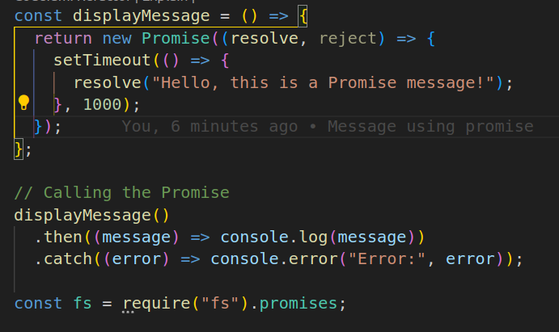
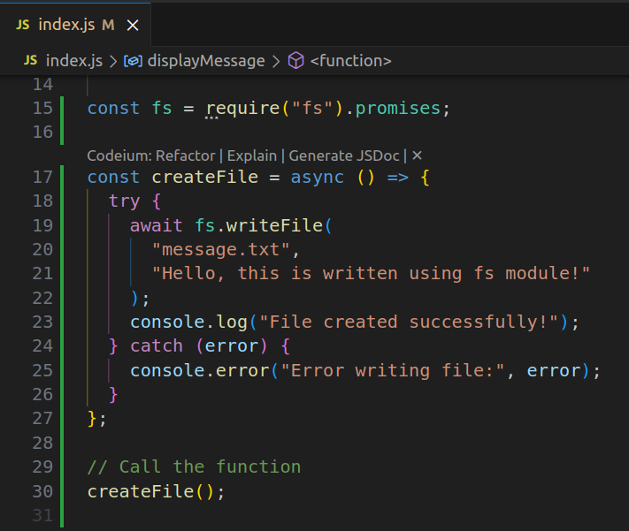
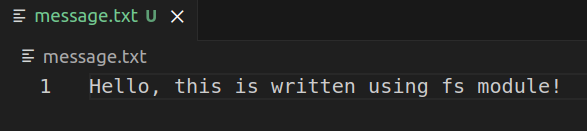

# Node_Assesment

The steps to be done
STEP 1: Create a node project

STEP 2: create a promoise to display a mesaage and cal the promise.

STEP 3: Initialize git and commit the code

STEP 4: Create a file using fs module and async/await.

STEP 5: Commit the code again.

STEP 1: Create a node project

Created package.json file using command
npm init -y

STEP 2: create a promoise to display a mesaage and cal the promise.
index.js

Run the command node index.js

STEP 3: Initialize git and commit the code

git init  
git add .  
git commit -m "Message"

STEP 4: Create a file using fs module and async/await.

Run the command node index.js

STEP 5: Commit the code again.

git add .  
git commit -m "Message"
